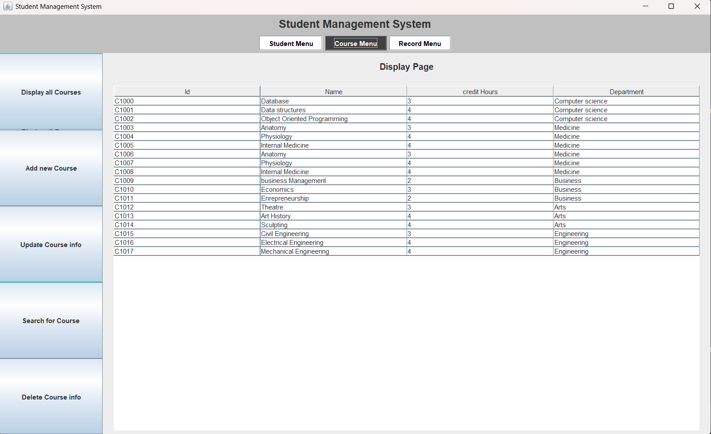

# Student manaagement system

An application that allows users to view and manage **students, courses, and grades** in a university.  
Built with **Java** and **MySQL**.

---

## 📸 Preview
 <!-- optional: add a screenshot of your project -->

---

## Features
- Manage students (add, update, delete, search)
- Manage courses (add, update, delete, search)
- Record and view course enrollments
- Automatic calculation of student GPA
- MySQL database integration
- GUI built with Java Swing (optional: add if true)

---

## Built With
- **Java (Swing, JDBC)**
- **MySQL Database**

## Project structure
student-management-system/
├── src/                   # Source code (Java classes, GUI, DB utils)
├── resources/             # (Optional) config files, SQL scripts
├── screenshot.png          # Project screenshot
└── README.md

### Prerequisites
- Java 17+ (or whichever version you used)
- MySQL installed and running
- A MySQL user and database created (e.g., `student_db`)

## How to Use
1. Clone the repository  
   git clone https://github.com/leawi-t/student-management-system.git

#Author
Leawi Taddesse
https://github.com/leawi-t
